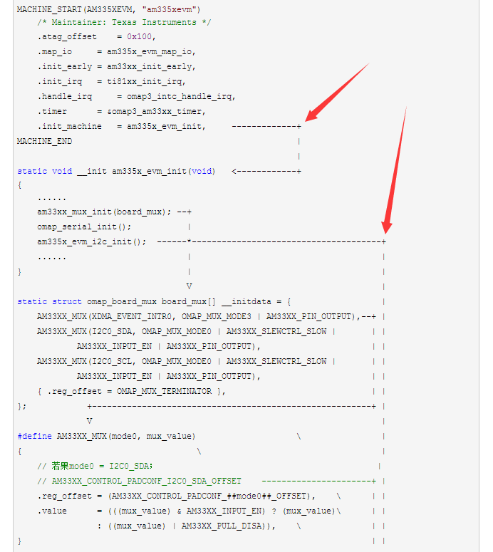

# EndingAlign
该工具是在Linux下，对文本文件右侧添加指定的字符，实现对齐，本人主要用于跟踪代码时画跟踪流程图。

## 思路来源

因为个人解读代码时，经常希望绘制如下的函数调用[流程图](http://www.cnblogs.com/zengjfgit/p/4613343.html)：
  
从上面的图形中可以看出，如果不能自动补充缺少的空格，那么将会需要手动输入大量的空格，如果这样做的话，采用这种方式跟踪代码最多会跟踪两次，太多地方要打空格了，在这种情况下，于是开发了EndingAlign这个工具来完成这项工作。

## 操作方法

* 使用make命令编译出程序：endingAlign
* 指定filename，并且以column值为列，也就是对文件以column列对齐，不够的以空格
填充:

```
    endingAlign -f <filename> -c <column>
    例：
    endingAlign -f readme.txt -c 80 
```

* 指定filename，删除每行末尾的空白字符：
填充:

```
    endingAlign -r -f <filename>
    例：
    endingAlign -r -f readme.txt
```


## Author

 [曾剑锋](http://www.cnblogs.com/zengjfgit/)  
